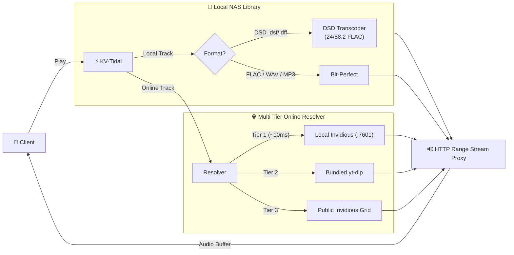
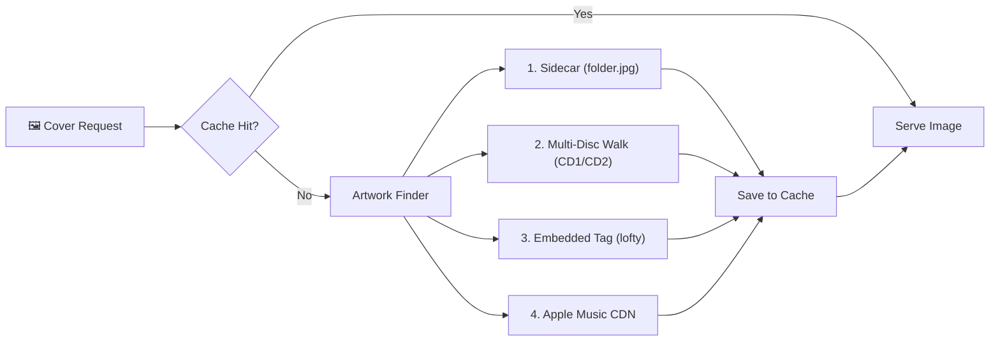
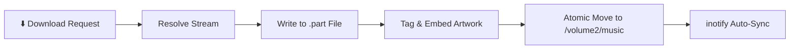

# KV-TIDAL 🎵

<p align="center">
  
</p>

<p align="center">
  <strong>Ultimate High-Resolution Music Streaming & Audiophile Vault for Synology NAS</strong>
</p>

<p align="center">
  <a href="https://pkg.khoavo.myds.me/package/kvtidal"></a>
  <a href="https://hub.docker.com/r/vndangkhoa/kv-tidal"></a>
  <a href="https://ghcr.io/vndangkhoa/kv-tidal"></a>
  <a href="https://git.khoavo.myds.me/vndangkhoa/kv-tidal"></a>
  
  
  
  
</p>

---

## 📖 Overview

**KV-Tidal** is a self-hosted, ultra-low-latency audiophile music streaming platform and downloader engineered specifically for **Synology NAS (DSM 7.0+)** and **Docker Container Manager**. 

Built with a high-concurrency **Rust Axum** backend and a responsive **Next.js 15 / React 19** dark-themed PWA frontend, KV-Tidal bridges your local lossless audio library with real-time online streaming, live trending charts, and an **OpenSubsonic** server compatible with all audiophile mobile and desktop players.

---

## ✨ Key Features

### 💎 Native Bundled Soulseek (`slskd`) Lossless P2P Engine (v1.0.0-22)
- **Self-Contained Bundled `slskd`**: The Linux x86_64 self-contained Soulseek daemon (`slskd` v0.26.0) is bundled directly inside the SPK package (`package/bin/slskd`, `package/share/slskd/`) and Docker container images. No external Docker, Container Manager, or manual setup required for public end-users.
- **Zero Fake FLACs**: Eliminated lossy YouTube audio transcoding. Downloaded files are 100% genuine studio lossless FLAC files (16-bit to 24-bit/96kHz Hi-Res masters, 25MB - 120MB) tagged with high-res album art and placed into `/volume2/music`.
- **Top-Right Corner Live Progress HUD**: Maps live `slskd` P2P transfer telemetry into an animated SVG radial progress ring, real-time percentage (`45%`), and transfer speed (`2.4 MB/s`).
- **Tidal HiFi Personal Bearer Token**: Optional support for personal Tidal subscriber Bearer Tokens in `/settings` to stream 24-bit / 192kHz Master FLAC directly from Tidal's official CDN (`sp-storage.tidal.com`).

### 🎚️ Luxury Audiophile Player Bar & Smart FLAC Auto-Download (v1.0.0-22)
- **Unified Stream Quality Capsule (`[ FLAC | OPUS | ✨ ]`)**: Clean, minimalist toggle eliminating redundant badges. Displays warm amber glow on Opus, high-tech cyan glow on FLAC, and a direct `<Sparkles />` trigger to inspect the bit-perfect hardware signal path.
- **Default Opus Streaming**: Online music searches and trending songs stream in fast, lightweight 160kbps Opus by default for instantaneous click-to-play startup.
- **Smart FLAC Auto-Download & Seamless Mid-Song Hot-Swap**: Tapping `FLAC` on an online track automatically triggers background Soulseek lossless retrieval, displays live transfer progress on the button (`[ ⏳ 45% | OPUS ]`), keeps playing Opus uninterrupted, and seamlessly hot-swaps to the bit-perfect FLAC Master at the exact millisecond upon completion.
- **Studio Audio Suite Popover**: Single-button studio suite consolidating 10-Band Parametric Equalizer & Headphone AutoEQ Presets, Real-Time FFT Spectrum Analyzer, and Analog Ballistic VU Meters (Accuphase / McIntosh needles).

### 🎵 100% Full-Length Music Streaming (No 30-Second Cutoffs)
- **Multi-Tier Stream Resolution Engine**: Resolves full-length audio streams with automatic failover:
  1. **Direct Tidal HiFi CDN**: Bit-perfect master FLAC when user token is configured.
  2. **Direct Local Invidious (`127.0.0.1:7601`)**: Instant ~10ms stream resolution running natively on your NAS with zero subprocess overhead.
  3. **Bundled Standalone `yt-dlp`**: Embedded Linux x86_64 ELF binary with built-in Python 3.11+ runtime and custom `TMPDIR` routing, bypassing Synology DSM's `noexec /tmp` mount limitations.
  4. **High-Reliability Public Invidious Grid**: Automatic fallback network across global Invidious instances (`inv.tux.pizza`, `invidious.nerdvpn.de`, `yewtu.be`).
- **Full HTTP Range Seeking**: Scrub and jump to any timestamp with zero latency using chunked byte-range requests.

### 🎛️ Studio-Grade DSD Transcoding & Bitstream Playback
- **On-The-Fly DSD Decimation (24-bit / 88.2 kHz)**: Web browsers cannot decode 1-bit DSD (`.dsf`, `.dff`). KV-Tidal decimates DSD streams in real-time into 24-bit / 88.2 kHz FLAC with mathematically bit-perfect power-of-2 integer sub-sampling (2.8224 MHz / 32 = 88.2 kHz).
- **Persistent Stream Cache**: Transcoded FLAC files are cached in `${DATA_DIR}/dsd_cache/` for instant subsequent seeking.
- **Hardware ALSA Direct Bitstream Playback**: Direct `/api/devices/play` dispatcher sending bit-perfect Native DSD / DoP (2.82MHz) or PCM to USB DACs connected to your Synology NAS.

### 📚 Sub-Millisecond Audiophile Library
- **Pre-Serialized JSON Caching**: Queries over 10,000+ local tracks respond in `< 1ms` under read lock.
- **Fast Alphabet Jump Scroller**: Responsive A-Z navigation bar supporting Vietnamese diacritic normalization (`Đ` -> `D`, `Ơ` -> `O`, `Ư` -> `U`) and numeric symbols.
- **Instant Album Inspection**: Dedicated `/api/library/album` endpoint displaying full album artwork, disc numbering, and sorted tracklists in a clean slide-over modal.

### 📁 macOS Finder Column Browser (Miller Columns)
- **Cascading File Explorer**: Navigate tens of thousands of tracks in `/files` with resizable cascading columns, horizontal auto-scroll, and full keyboard navigation (`←`, `→`, `↑`, `↓`, `Spacebar`).
- **Audio QuickLook Inspector**: Audiophile side pane featuring album sleeve preview, Dynamic Range (DR) rating gauge, Hi-Res codec badge (`24-bit / 96kHz FLAC`, `DSD64`), audio specs grid, and 1-click clipboard path copy.

### 🖼️ Multi-Tier Local Cover Art Resolver (`/api/fs/cover`)
- **4-Tier Artwork Discovery**:
  1. Sidecar image inspection (`folder.jpg`, `cover.jpg`, `front.jpg`, `cover.png`).
  2. Parent directory traversal (for multi-disc releases like `CD1`, `CD2`, `Mat A`, `Mat B`).
  3. Embedded audio tag extraction (ID3v2, Vorbis Comments, MP4 cover) via native `lofty`.
  4. Apple Music 1000x1000 high-res CDN fallback with persistent disk caching in `${DATA_DIR}/covers/`.
- **Full-Resolution Zoom Lightbox**: Inspect high-res vinyl artwork and booklet sleeves with 1 click.

### 🇻🇳 Live Vietnamese & Global Trending Top 50
- **Automated RSS Ingestion**: Live Top 50 trending songs and albums in Vietnam and Worldwide updated continuously with high-resolution artwork.

### 📱 Universal OpenSubsonic Ecosystem
- Fully compliant **OpenSubsonic API (`/rest`)** supporting:
  - **Symfonium** (Android)
  - **Feishin** (Windows, macOS, Linux)
  - **Tempo / Ample** (iOS)
  - **Substreamer** & **DStrem**

---

## 🚀 Installation & Deployment

### Option 1: Native Synology SPK Package (Recommended)

Running as a native DSM package consumes **less than 25MB RAM** with near-zero CPU idle footprint.

#### Method A: Synology Package Center (Automatic Feed)
1. In Synology DSM, open **Package Center** → **Settings** → **Package Sources**.
2. Click **Add** and enter:
   - **Name**: `KV Apps`
   - **Location**: `https://pkg.khoavo.myds.me`
3. Click **Community** tab, search for **KV-Tidal**, and click **Install**.

#### Method B: Manual SPK Install
1. Download the latest package:
   - **[⬇️ Download kvtidal-1.0.0-22.spk](https://spk.khoavo.myds.me/kvtidal-1.0.0-22.spk)**
2. In DSM **Package Center**, click **Manual Install** in the top right.
3. Select `kvtidal-1.0.0-22.spk` and follow the setup wizard:
   - **Music Directory**: Automatically defaults to `/volume2/music` or `/volume1/music`.
   - **Port**: Default is `26784`.
   - **Subsonic User / Password**: Set your desired credentials (default: `admin` / `admin`).
4. Click **Apply**. KV-Tidal will start automatically and appear in your DSM Application Launcher!

---

### Option 2: Docker / Synology Container Manager

KV-Tidal is published to Docker Hub, GitHub Container Registry, and Forgejo:

```bash
docker run -d \
  --name kv-tidal \
  --restart unless-stopped \
  -p 26784:8080 \
  -v /volume2/music:/music:ro \
  -v /volume1/docker/kv-tidal/data:/data \
  -e HOST=0.0.0.0 \
  -e PORT=8080 \
  -e MUSIC_DIR=/music \
  -e DATA_DIR=/data \
  vndangkhoa/kv-tidal:latest
```

#### Docker Compose (`docker-compose.yml`)

```yaml
version: "3.8"

services:
  kv-tidal:
    image: vndangkhoa/kv-tidal:latest
    container_name: kv-tidal
    restart: unless-stopped
    ports:
      - "26784:8080"
    environment:
      - HOST=0.0.0.0
      - PORT=8080
      - PUID=1026
      - PGID=100
      - MUSIC_DIR=/music
      - DATA_DIR=/data
    volumes:
      - /volume2/music:/music:ro
      - /volume1/docker/kv-tidal/data:/data
```

---

## 📱 Connecting Subsonic Mobile & Desktop Apps

Connect your favorite mobile app (such as **Symfonium** on Android or **Tempo** on iOS) to stream your NAS music anywhere:

| Setting | Value |
| :--- | :--- |
| **Server Type** | Subsonic / OpenSubsonic |
| **Server URL** | `http://<synology-ip>:26784` (or your reverse proxy domain) |
| **Username** | `admin` (or user configured during install) |
| **Password** | `admin` (or password configured during install) |
| **Client Name** | `Symfonium`, `Feishin`, etc. |

---

## ⚙️ Configuration Reference (`config.json`)

Stored in `/var/packages/kvtidal/etc/config.json` (SPK) or `/data/config.json` (Docker):

```json
{
  "host": "0.0.0.0",
  "port": 26784,
  "puid": 1026,
  "pgid": 100,
  "data_dir": "/var/packages/kvtidal/var",
  "web_dir": "/var/packages/kvtidal/target/web",
  "subsonic_user": "admin",
  "subsonic_password": "admin",
  "download_dir": "/volume2/music",
  "libraries": [
    {
      "name": "Synology Music Share",
      "path": "/volume2/music",
      "is_download_target": true,
      "watch_changes": true
    }
  ]
}
```

---

## 🔄 Data Flow Architecture

### 1. Audio Streaming Pipeline



---

### 2. Cover Art Discovery Flow



---

### 3. Atomic Lossless Download Flow



---

## 🏗️ Architecture

```
kv-tidal/
├── backend/                  # Rust 1.85 Engine (Axum, Tokio, Lofty, Tower)
│   ├── src/
│   │   ├── main.rs           # Web server, unified routes & static file server
│   │   ├── config.rs         # Synology user & permission lifecycle
│   │   ├── api/
│   │   │   ├── stream.rs     # Lossless audio streaming & DSD 24/88.2 FLAC transcoder
│   │   │   ├── library.rs    # Pre-serialized library cache & album endpoint
│   │   │   ├── fs.rs         # Column browser & sidecar cover art resolver
│   │   │   ├── devices.rs    # ALSA hardware bitstream dispatcher (/proc/asound)
│   │   │   └── download.rs   # Atomic FLAC downloader with telemetry
│   │   ├── engines/
│   │   │   ├── stream_resolver.rs # Multi-tier Invidious & yt-dlp resolver
│   │   │   └── tidal.rs      # Tidal & Qobuz metadata & stream engine
│   │   ├── subsonic/         # OpenSubsonic v1.16.1 protocol engine
│   │   └── storage/          # inotify file watcher & mtime scanner cache
│   └── Cargo.toml
├── frontend/                 # Next.js 15+ React 19 Frontend (Tailwind CSS, Lucide)
│   ├── src/
│   │   ├── app/              # App Router (Trending, Search, Library, Files, Settings)
│   │   ├── components/       # Player, AlphabetScroller, QuickLook, AlbumModal
│   │   └── utils/alphabet.ts # Vietnamese diacritics & letter indexing
│   └── package.json
├── spk/                      # Synology SPK Package Toolchain
│   ├── INFO                  # DSM 7 package metadata manifest
│   ├── conf/privilege        # DSM 7 ACL & sc-kvtidal permissions
│   ├── scripts/              # Lifecycle (postinst, start-stop-status, upgrades)
│   └── build-spk.sh          # 1-click Debian Bookworm SPK assembler
├── Dockerfile                # Multi-stage production container
└── docker-compose.yml        # Container Manager specification
```

---

## 📄 License

MIT License. Crafted with precision for the ultimate homelab audiophile experience on Synology NAS.
